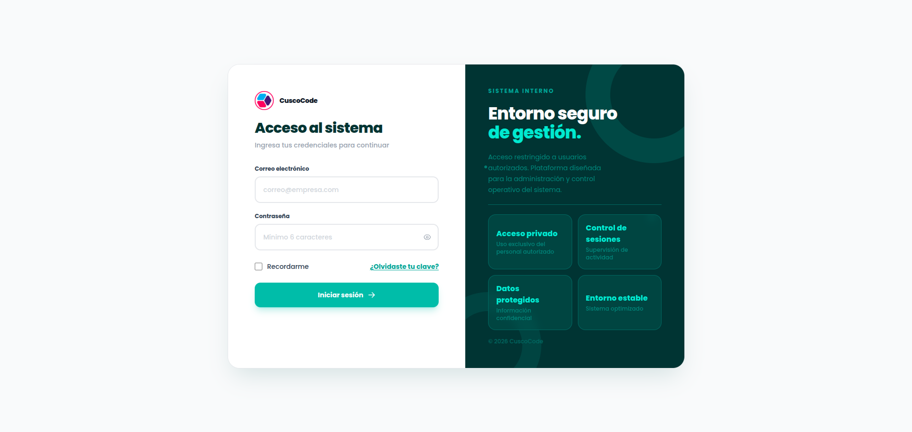
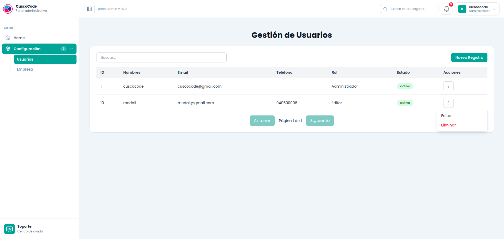
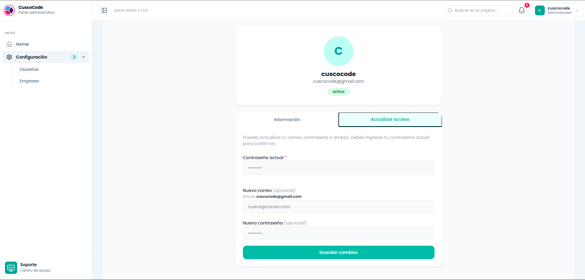

# NestJS + React Fullstack Boilerplate

Base fullstack lista para usar en cualquier proyecto. Construida con NestJS en el backend y React + Vite en el frontend. Incluye autenticación JWT, control de roles, CRUD completo y estructura escalable lista para producción.

---

## Tecnologías

| Backend | Frontend |
|---|---|
| NestJS + TypeORM | React 19 + Vite |
| MySQL | Tailwind CSS v4 |
| JWT + Cookies HttpOnly | Zustand + React Query |
| Class Validator + Zod | React Hook Form + Zod |

---

## Estructura del repositorio

```
/
├── backend_nestjs/     # API REST con NestJS
│   └── public/         # Código compilado del frontend (opcional, ver despliegue unificado)
└── front_end/          # SPA con React + Vite + Tailwind
```

---

## Requisitos previos

- Node.js 18+
- MySQL 8+
- npm

---

## Base de datos

Ejecutar el script ubicado en `base de datos/db_nestjs.sql`:

```sql
drop database if exists db_nestjs;
create database db_nestjs CHARACTER SET utf8mb4;
use db_nestjs;

drop table if exists tusuario;
create table tusuario(
  id int not null auto_increment,
  nombres varchar(50) not null,
  email varchar(100) UNIQUE,
  telefono varchar(9),
  estado ENUM('activo','inactivo') NOT NULL DEFAULT 'activo',
  password text null,
  tipo_usuario varchar(15),
  primary key (id)
);

DROP PROCEDURE IF EXISTS IniciarSesion;
DELIMITER $$
CREATE PROCEDURE IniciarSesion(
    IN _email VARCHAR(100),
    IN _password VARCHAR(255)
)
BEGIN
    DECLARE _id INT DEFAULT NULL;
    DECLARE _nombres VARCHAR(50);
    DECLARE _tipo_usuario VARCHAR(15);

    SELECT id, nombres, tipo_usuario
    INTO _id, _nombres, _tipo_usuario
    FROM tusuario
    WHERE email = _email
      AND password = SHA2(_password, 256)
      AND estado = 'activo'
    LIMIT 1;

    IF _id IS NOT NULL THEN
        SELECT _id AS id, _nombres AS nombres, _tipo_usuario AS tipo_usuario,
               1 AS cod, 'Inicio de sesión exitoso' AS mensaje;
    ELSE
        SELECT NULL AS id, NULL AS nombres, NULL AS tipo_usuario,
               0 AS cod, 'Credenciales inválidas o usuario inactivo' AS mensaje;
    END IF;
END$$
DELIMITER ;
```

Insertar usuario administrador inicial:

```sql
INSERT INTO tusuario (nombres, email, estado, password, tipo_usuario)
VALUES ('cuscocode', 'cuscocode@gmail.com', 'activo', SHA2('123456', 256), 'Administrador');
```

---

## Cómo correr el proyecto

### Backend

```bash
cd backend_nestjs
npm install
```

Crear archivo `.env` en la raíz de `backend_nestjs/`:

```env
DB_TYPE=mysql
DB_HOST=localhost
DB_PORT=3306
DB_USERNAME=root
DB_PASSWORD=
DB_DATABASE=db_nestjs

#nestjs
PORT=3000
CLAVE_JWT=#tu clave jwt
EXPIRACION_JWT=8h
CLAVE_ENCRIPTACION=#clade de encriptacion

URL_FRONTEND=http://localhost:5173/
```

```bash
npm run start:dev
```

La API estará disponible en `http://localhost:3000/api`

### Frontend

```bash
cd front_end
npm install
npm run dev
```

El frontend estará disponible en `http://localhost:5173`

---

## Despliegue unificado (opcional)

Es posible servir el frontend y backend desde un único servidor. Al compilar el frontend y copiar el resultado en `backend_nestjs/public/`, NestJS servirá automáticamente la aplicación React:

- `/` → Aplicación React (archivos estáticos desde `public/`)
- `/api` → API REST de NestJS

```bash
# 1. Compilar el frontend
cd front_end
npm run build

# 2. Copiar el contenido de /front_end/dist a /backend_nestjs/public/
```

Con esto el proyecto queda como un único servidor listo para producción.

---
## Vista previa





## Documentación

- [📄 Documentación Backend — NestJS](./backend_nestjs/README.md)
- [📄 Documentación Frontend — React](./front_end/README.md)

---

## Créditos

Desarrollado por **Raul Hacho Cutipa**  
Cusco, Perú — Ingeniero de Sistemas · Desarrollador Full Stack
